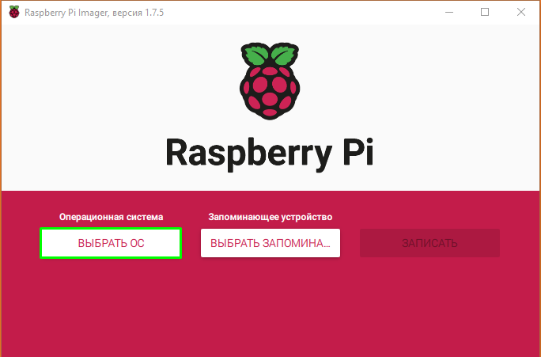
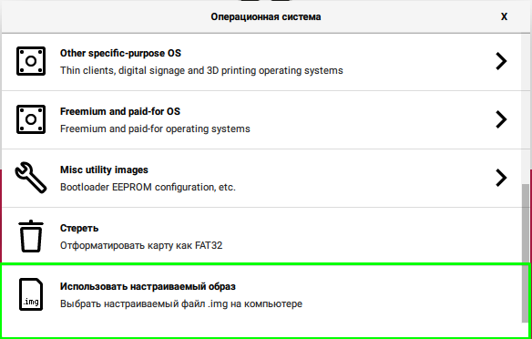
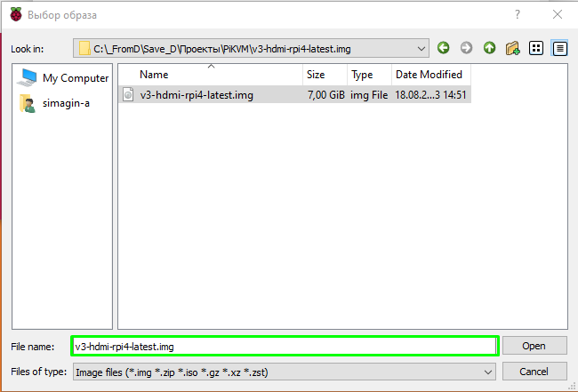
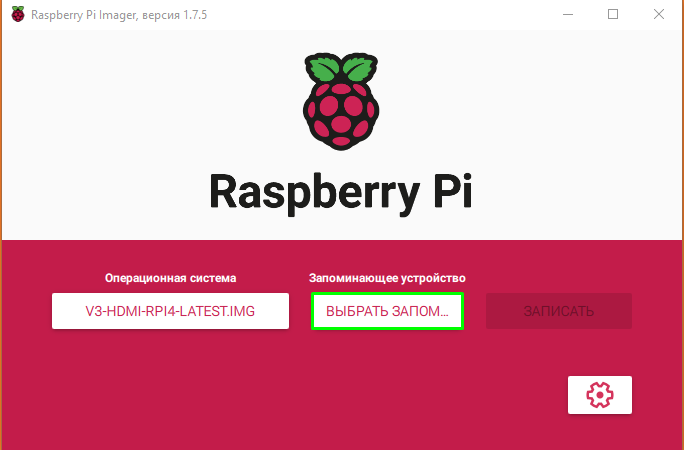
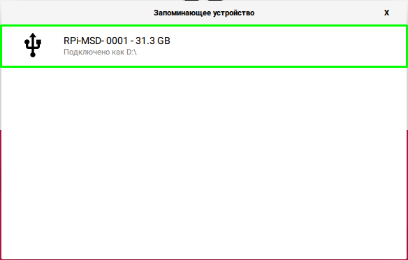
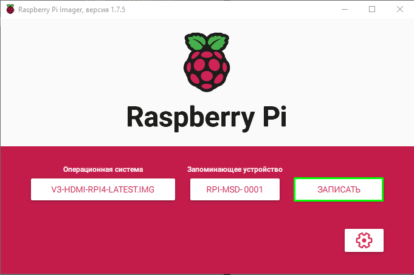

# How to flash BliKVM

1. Download all soft and firmware  

    1 RPI-Imager  
[RPI-Imager](https://github.com/raspberrypi/rpi-imager/releases/download/v1.7.5/imager-1.7.5.exe)

    2 usbboot  
[usbboot](https://github.com/raspberrypi/usbboot/archive/refs/heads/master.zip)

    3 Firmware  
[firmaware](https://files.pikvm.org/images/v3-hdmi-rpi4-latest.img.xz)

2. Unpack and Install soft  

    1 Unpack usbboot-master.zip.  

    2 Install usbboot-master\win32\rpiboot_setup.exe

    3 Install imager-1.7.5.exe (RPI-Imager)

    4 Unpack firmware

3. Prepare hardware  

    1 Open metal case

    2 Move Jumper from 1-2 to 2-3. (From G-G to BOOT)

    3 Connect BliKVM to PC, use USB Type-C.

4. Flash  

    1 Run rpiboot as Administrator

    2 Run "Raspberry Pi Imager" as Administrator and see screenshots below

    3 Power off BliKVM

    4 Set Jumper from 2-3 to 1-2 for run OS (NOT BOOT)

    5 Power on BliKVM

Notes:
If error occured when you press "WRITE", reboot PC.
