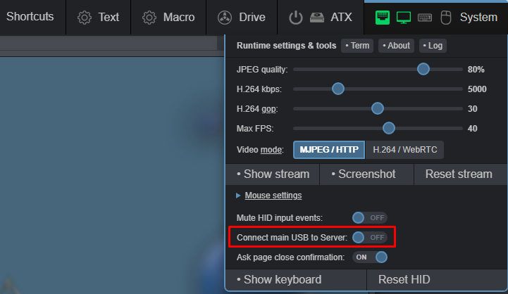
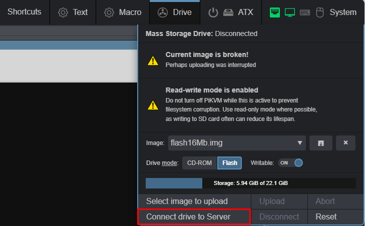
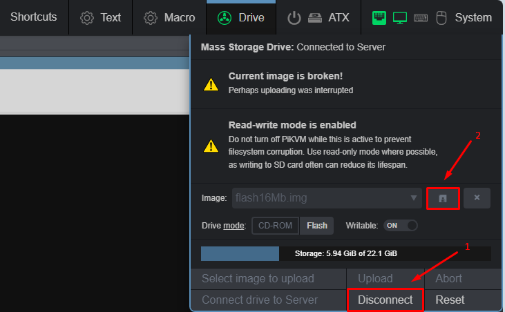
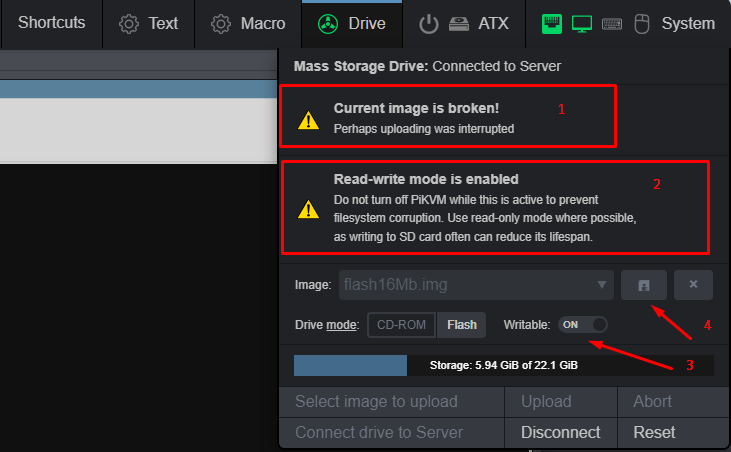

# Mass storage

## Change media type in the WEB UI

  

## Settings in blikvm console

```bash
# change blikvm storage to Read Write mode
kvmd-helper-otgmsd-remount rw
# 
cd /var/lib/kvmd/msd/
# create file size of 'count' Mb
dd if=/dev/zero of=flash.img bs=1M count=16 status=progress
# make file system in file
mkfs.ext4 flash16Mb.img
#
chown kvmd: flash16Mb.img
#
kvmd-helper-otgmsd-remount ro
```

## Connect drive to ARM

  

## Settings in KVM arm

```bash
# if need
sudo mkdir /mnt/flash
#
mount /dev/sdb /mnt/flash
#write info to disk
touch /mnt/flash/test.txt
#
cd ~
#
umount /mnt/flash
```

## Download image

Go to WEB UI and Download image
  

## Notes

1. Probably WEB UI bug, images file work normally
2. Just use RW mode only when need write to image
3. Write mode for image
4. Download image (first umount, disconnect image)

  
